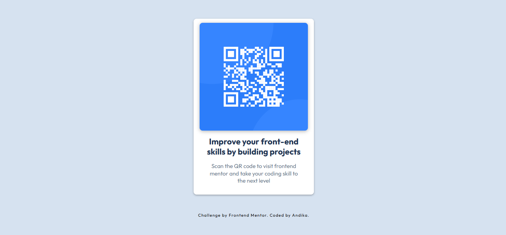

# QR Code Component

A simple and responsive QR Code Component built as part of a Frontend Mentor challenge.

This project was created to practice building a clean user interface using HTML and CSS, with a focus on responsive layout, typography, spacing, and visual design.

## Preview



## Technologies

- HTML5
- CSS3
- Google Fonts (Outfit)

## What I Learned

- Building a responsive layout with CSS
- Using Flexbox for alignment
- Working with CSS variables
- Creating responsive designs with media queries
- Managing spacing, typography, and colors

## Project Structure

```text
qr-code-component/
├── index.html
├── style.css
├── image-qr-code.png
├── favicon-32x32.png
└── screenshot.png
```

## HTML

```html
<div class="container">
  <div class="bg_qr">
    <div class="items_qr">
      
    </div>

    <div class="des_qr">
      <h1>Improve your front-end skills by building projects</h1>
      <p>
        Scan the QR code to visit Frontend Mentor and take your coding
        skills to the next level.
      </p>
    </div>
  </div>
</div>
```

## CSS

```css
.container {
  height: 100dvh;
  display: flex;
  justify-content: center;
  align-items: center;
  flex-direction: column;
}

.bg_qr {
  background-color: white;
  width: 320px;
  padding: 1rem 1.2rem;
  border-radius: .5rem;

  display: flex;
  flex-direction: column;
  align-items: center;
}

.items_qr {
  width: 288px;
  height: 288px;
  border-radius: .5rem;
  overflow: hidden;
}

.items_qr img {
  width: 100%;
  height: 100%;
  object-fit: cover;
}
```

## Challenge

This project is based on the **QR code component challenge** from Frontend Mentor.

## Author

Coded by **Andika**.
